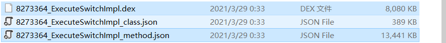

# DexPatcher
###### 使用[AUPK](https://github.com/FeJQ/AUPK)脱壳后，用该程序来修复Dex文件。

参数：

```shell
options:
  -v, --version      get versison and building information
  -f, --fix          fix the dex file
  -d, --dex-path     the dex file path (string [=])
  -j, --json-path    the json file path (string [=])
  -n, --nolog        don't print logs
  -?, --help         print this message
```

###### 下载：

百度网盘

链接：https://pan.baidu.com/s/1aMspPKrz2LmkHyCKLMD1sw 
提取码：aupk 

or

releases:https://github.com/FeJQ/DexPatcher/releases/tag/v0.1.0


如：

1. 通过AUPK得到`8273364_ExecuteSwitchImpl.dex`和`8273364_ExecuteSwitchImpl_method.json`两个文件



2. 此时即可执行以下命令来修复Dex文件：

   ```shell
   $ dp fix -d 8273364_ExecuteSwitchImpl.dex -j 8273364_ExecuteSwitchImpl_method.json --nolog
   ```

3. 等待片刻，即可完成修复：


4. 带`patched`后缀的就是修复后的Dex文件：


效果：


用到的库：

+ [cmdline](https://github.com/tanakh/cmdline)

+ [nlohmann/json](https://github.com/nlohmann/json)